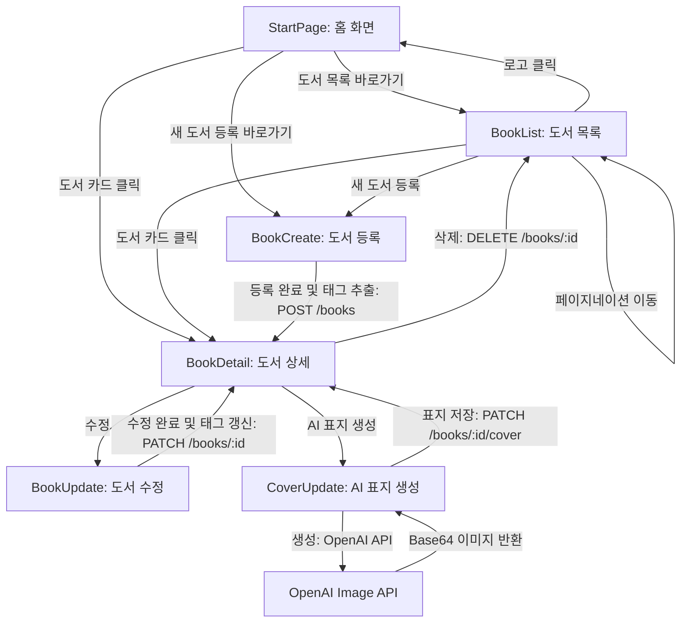
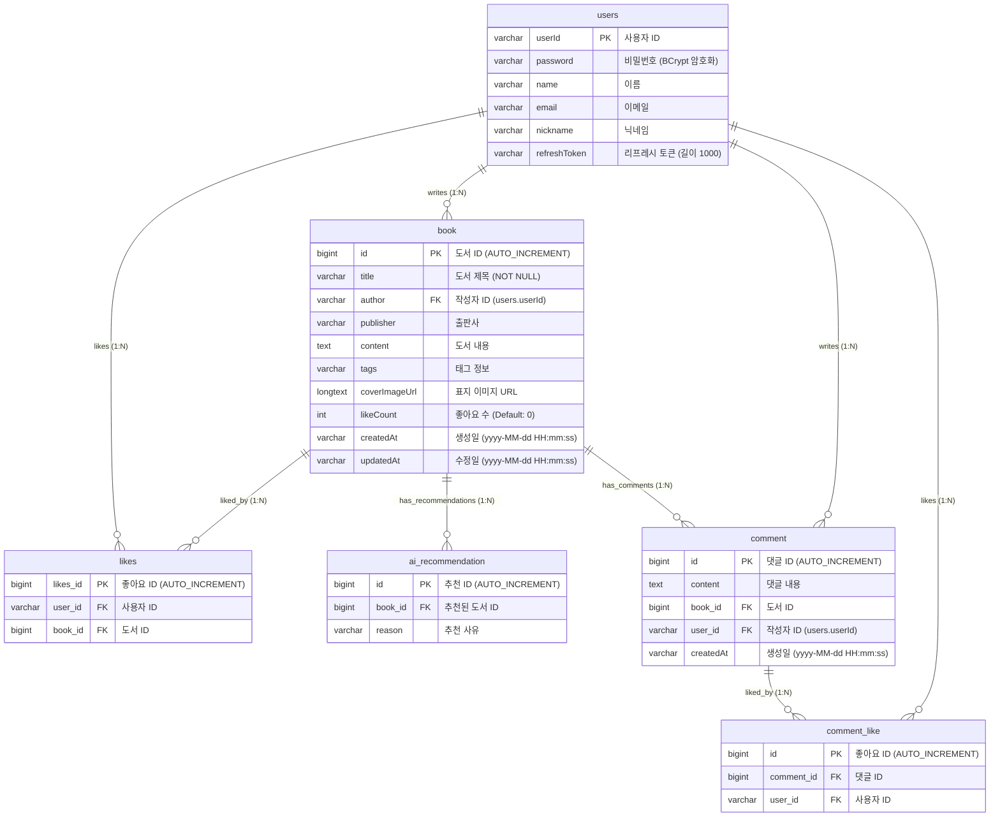

# AivleBooks (창작 서재 관리 서비스)
**KT 에이블스쿨 9기 미니프로젝트 5차 (2반 3조)**  
* **팀원**: 신동준, 정찬진, 박지함, 임현수, 조용원, 박준희, 홍경표, 장천명

> **"AI와 독서를 연결하는 창작형 독서 플랫폼"**  
> 본 프로젝트는 사용자가 작성한 도서의 메타데이터와 본문 글을 관리하고, OpenAI의 DALL-E (IMAGE API)를 연동하여 책 내용에 어울리는 표지 시안을 생성·보관하는 통합 웹 서비스입니다. 
> React 프론트엔드 애플리케이션과 Spring Boot 백엔드 API 서버가 유기적으로 통신하여 완결성 높은 시스템을 구성합니다.

---

## 기술 스택 (Tech Stack)

### 1. Frontend
* **Framework & Build**: React, Vite
* **HTTP Client**: Axios
* **Styling (CSS)**: Vanilla CSS

### 2. Backend & Database
* **Framework & Tooling**: Spring Boot 4.0.6, Gradle
* **Language**: Java 17
* **Database**: H2 Database (로컬 파일 저장 모드: `jdbc:h2:file:~/bookdb`)
* **ORM**: Spring Data JPA & Hibernate
* **Security & Auth**: Spring Security, JWT (Json Web Token), BCrypt 비밀번호 암호화
* **Utilities**: Lombok, Spring Boot Validation, OpenAI RestClient 연동

---

## 프로젝트 아키텍처 및 서비스 흐름 (Architecture & Flow)

### 1. 백엔드 계층형 구조 (Layered Architecture)
* **Controller (표현 계층)**: HTTP 요청 수신, API 라우팅, CORS 설정 및 `@RestControllerAdvice`를 통한 글로벌 예외 제어
* **Service (비즈니스 계층)**: 도메인의 흐름 제어, 핵심 비즈니스 로직 처리 및 `@Transactional` 단위 설정
* **Repository (데이터 액세스 계층)**: Spring Data JPA 인터페이스(`JpaRepository`)를 활용한 DB CRUD 및 쿼리 메서드 정의
* **Domain (엔티티 계층)**: 데이터베이스 테이블 매핑용 영속성 객체 정의 및 JPA 관계성 구성

### 2. 서비스 페이지 흐름도 (Service Flow Diagram)


### 3. 데이터베이스 모델링 (ERD)


---

## 설계 핵심 포인트 (Design & Implementation Points)

### 1. DTO (Data Transfer Object) 활용 극대화
* **Entity 직접 노출 방지**: 데이터베이스 물리 구조가 매핑된 JPA Entity를 클라이언트에 그대로 노출시키지 않고, 필요한 필드 데이터만 가공하여 제공해 보안 및 결합도를 낮췄습니다.
* **요청/응답 구조의 명확성 분리**: 회원가입, 로그인, 도서 등록 및 좋아요 처리 시 필요한 매개변수를 Request/Response DTO로 독립화하여 유지보수성을 극대화했습니다.

### 2. 도서 좋아요 (Likes) 정밀 토글 시스템
* **중복 방지 설계**: 동일 유저가 같은 도서에 대해 1회를 초과하여 추천을 누를 수 없도록 `user_id`와 `book_id` 기반의 Unique Constraints를 구성했습니다.
* **토글 프로세스**: 사용자가 추천 버튼을 재클릭할 시, 시스템 내부적으로 기존 Likes 레코드를 삭제하고 `Book.likeCount`를 차감하여 실시간으로 정량적인 인기 도서 랭킹을 관리합니다.

### 3. JWT 기반 토큰 생명주기 및 필터 처리
* **Access/Refresh Token 발급**: 로그인 성공 시 짧은 주기의 Access Token(API 요청 인증용, Authorization Bearer 탑재)과 긴 주기의 Refresh Token(DB 저장 및 대조를 통한 무인증 갱신용)을 동시에 생성 및 배포합니다.
* **JwtAuthenticationFilter**: 들어오는 모든 요청의 헤더에서 JWT를 검증하고, 유효한 토큰일 경우 `SecurityContextHolder`에 인증 정보(`UsernamePasswordAuthenticationToken`)를 주입하여 로그인 사용자를 식별합니다.

---

## 로컬 실행 및 설정 가이드 (Getting Started)

### 1. 환경 설정 (Configuration)
`src/main/resources/application.yml` 파일에서 데이터베이스 및 JWT 설정을 확인합니다.
```yaml
spring:
  datasource:
    driver-class-name: org.h2.Driver
    url: jdbc:h2:file:~/bookdb;  # 로컬 H2 파일 모드
    username: sa
    password: 1234
  h2:
    console:
      enabled: true
      path: /h2-console
jwt:
  secret: aivle-bookapp-jwt-secret-key-2026!
  access-expiration: 3600000    # 1시간
  refresh-expiration: 86400000   # 24시간
```

### 2. 백엔드 실행 방법 (PowerShell / Terminal)
API 기본 Endpoint 포트는 `8080`입니다.
```powershell
./gradlew.bat bootRun
```
* **H2 Database Console**: `http://localhost:8080/h2-console`
  - JDBC URL: `jdbc:h2:file:~/bookdb`
  - User Name: `sa` / Password: `1234`

### 3. 프론트엔드 실행 방법
프론트엔드 소스 디렉토리에서 아래 명령어로 리액트 개발 서버를 시작합니다.
```bash
npm install
npm run dev
```
* 로컬 접속 URL: `http://localhost:5173`

---

## API 명세서 (API Specification)

> **인증 권한 안내**: 인증 필수가 `O`인 API는 요청 헤더에 `Authorization: Bearer <JWT_ACCESS_TOKEN>`을 실어 전송해야 합니다.

### 1. 사용자 및 인증 API (`/users`)
| HTTP Method | Endpoint | 인증 필요 | 기능 설명 | Request Payload | Response Payload |
| :--- | :--- | :---: | :--- | :--- | :--- |
| **POST** | `/users/register` | X | 신규 회원가입 (이름, 아이디, 비밀번호, 이메일, 닉네임 필수값) | `{ "userId": "id", "password": "pw", "name": "이름", "email": "이메일", "nickname": "닉네임" }` | **201 Created**<br>`{ "userId": "id", "name": "이름", ... }` |
| **POST** | `/users/login` | X | 로그인 (JWT 발급 및 DB Refresh Token 등록) | `{ "userId": "id", "password": "pw" }` | **200 OK**<br>`{ "accessToken": "...", "refreshToken": "...", "userId": "id", "nickname": "닉네임" }` |
| **POST** | `/users/refresh` | X | Access Token 만료 시 갱신 | `{ "refreshToken": "..." }` | **200 OK**<br>`{ "accessToken": "..." }` |
| **GET** | `/users/me` | O | 현재 로그인한 사용자 프로필 조회 | 없음 | **200 OK**<br>`{ "userId": "id", "name": "이름", "email": "이메일", "nickname": "닉네임" }` |
| **PATCH** | `/users/me` | O | 프로필 정보 수정 및 새 토큰 재발급 | `{ "nickname": "닉네임", "email": "이메일", "oldPassword": "기존비밀번호", "newPassword": "새비밀번호" }` (선택) | **200 OK**<br>`{ "userId": "id", "nickname": "닉네임", "accessToken": "...", "refreshToken": "..." }` |

### 2. 도서 API (`/books`)
| HTTP Method | Endpoint | 인증 필요 | 기능 설명 | Request Params / Payload | Response Payload |
| :--- | :--- | :---: | :--- | :--- | :--- |
| **GET** | `/books` | X | 도서 검색 및 페이징 조회 | Query String: `searchType`, `keyWord`, `sortBy`, `order`, `page` | **200 OK**<br>`{ "content": [ { "id": 1, "title": "도서명", "author": { "userId": "id", "nickName": "닉네임" }, "publisher": "...", "likeCount": 0 } ], "totalPages": 1, "currentPage": 1 }` |
| **GET** | `/books/{id}` | X | 도서 상세 조회 | 없음 | **200 OK**<br>`{ "id": 1, "title": "도서명", ... }` |
| **GET** | `/books/new` | X | 신작 도서 3권 조회 | 없음 | **200 OK**<br>`[ { "id": 1, "title": "도서명", ... } ]` |
| **GET** | `/books/popular` | X | 인기 도서 3권 조회 | 없음 | **200 OK**<br>`[ { "id": 1, "title": "도서명", ... } ]` |
| **POST** | `/books` | X* | 도서 신규 등록 (title, content 필수값) | `{ "title": "제목", "author": { "userId": "id" }, "publisher": "...", "content": "..." }` | **201 Created**<br>`{ "id": 1, "title": "제목", ... }` |
| **PATCH** | `/books/{id}` | O | 도서 정보 수정 (본인 작성 글만 허용) | `{ "title": "수정제목", "publisher": "출판사", "content": "내용", "author": { "userId": "id" } }` (author 필수) | **200 OK**<br>`{ "id": 1, "title": "수정제목", ... }` |
| **DELETE** | `/books/{id}` | O | 도서 삭제 (본인 작성 글만 허용) | 없음 | **204 No Content** |
| **PATCH** | `/books/{id}/cover` | O | AI 생성한 책 표지 이미지 반영 | `{ "coverImageUrl": "Base64 이미지 데이터" }` | **200 OK**<br>`{ "id": 1, "coverImageUrl": "...", ... }` |
| **POST** | `/books/{id}/like` | O | 도서 추천 수(좋아요) 토글 | `{ "userId": "사용자ID" }` | **200 OK**<br>`{ "id": 1, "likeCount": 1, ... }` |
| **GET** | `/books/ai-recommendation` | X | 이 달의 캐시된 AI 추천 배너 데이터 조회 (인기도서 기반 생성) | 없음 | **200 OK**<br>`{ "id": 1, "title": "도서명", "coverImageUrl": "...", "reason": "AI 추천이유" }` |

### 3. 댓글 API (`/books/{bookId}/comments`)
| HTTP Method | Endpoint | 인증 필요 | 기능 설명 | Request Payload | Response Payload |
| :--- | :--- | :---: | :--- | :--- | :--- |
| **GET** | `/books/{bookId}/comments` | X | 도서별 댓글 목록 조회 (정렬 지원) | Query String: `sort` (likes, createdAt) | **200 OK**<br>`[ { "id": 1, "content": "댓글내용", "createdAt": "...", "nickname": "닉네임", "userId": "아이디", "likeCount": 0 } ]` |
| **POST** | `/books/{bookId}/comments` | O | 댓글 등록 | `{ "content": "댓글 작성 내용" }` | **200 OK**<br>`"댓글이 성공적으로 등록되었습니다."` |
| **DELETE** | `/books/{bookId}/comments/{commentId}` | O | 댓글 삭제 (본인 작성 댓글만 허용) | 없음 | **200 OK**<br>`"댓글이 성공적으로 삭제되었습니다."` |
| **POST** | `/books/{bookId}/comments/{commentId}/like` | O | 댓글 추천(좋아요) 토글 | 없음 | **200 OK**<br>`{ "liked": true, "message": "좋아요를 눌렀습니다." }` |

---

## 트러블슈팅 (Troubleshooting)

### 1. CORS(Cross-Origin Resource Sharing) 에러 해소
* **문제 현상**: React 프론트엔드(`localhost:5173`)에서 Spring Boot 백엔드(`localhost:8080`)로 비동기 요청을 보낼 때, 브라우저의 동일 출처 정책(SOP)을 위반하여 요청이 차단되는 문제 발생.
* **해결 방법**: Spring Security 설정 파일(`SecurityConfig.java`)에 CORS 허용 환경을 명시하고, 글로벌 WebMvcConfigurer를 구성하거나 컨트롤러 레벨에 `@CrossOrigin(origins = "http://localhost:5173")` 설정을 적용하여 외부 출처의 API 접촉 문제를 해소하였습니다.

### 2. 마이페이지 회원정보 수정 시 비밀번호 변경 검증 체계 강화
* **문제 현상**: 사용자 프로필 정보 수정 시 기존 비밀번호 검증 단계를 거치지 않고 신규 비밀번호로 재인코딩 처리를 하거나, 누락된 필드로 인해 비밀번호 데이터 손상이 일어날 수 있는 취약성 발생.
* **해결 방법**: `UserService.updateProfile` 내부에서 `newPassword` 수정 요청을 가로챌 때 `oldPassword` 입력을 강제하고, `passwordEncoder.matches(oldPassword, user.getPassword())` 검증을 수행한 후에만 `BCrypt`로 새 비밀번호를 암호화하여 저장하도록 비즈니스 검증 레이어를 보완하였습니다.

### 3. 댓글 삭제 시 관련 댓글 좋아요 데이터의 외래 키 제약 위배 해결
* **문제 현상**: 특정 댓글을 삭제하려고 할 때, 해당 댓글을 추천(좋아요)한 관계 데이터인 `CommentLike` 엔티티가 외래 키 제약 조건으로 남아 있어 `DataIntegrityViolationException` 예외가 발생하며 삭제에 실패함.
* **해결 방법**: `CommentService.deleteComment` 에서 댓글 엔티티를 제거하기 직전에 `commentLikeRepository.deleteByCommentId(commentId)`를 선행 호출하여 관계 데이터의 무결성 충돌(외래 키 위배)을 해소한 뒤 댓글 데이터를 안전하게 삭제 처리했습니다.

### 4. 로그아웃 API 호출 시 SecurityContext 인증 정보 잔존 문제 대응
* **문제 현상**: 사용자가 로그아웃 API(`POST /users/logout`)를 호출하여 데이터베이스에 연동된 `refreshToken`을 정상적으로 null화 처리하였음에도 불구하고, 현재 실행 중인 요청 스레드 내부의 `SecurityContext` 상에 기존 유저 인증 객체가 잔존해 있는 이슈 발견.
* **해결 방법**: `UserController.logout` 내부에 DB 리프레시 토큰 청소 로직 완료 후 `SecurityContextHolder.clearContext()`를 호출하도록 안전망을 구축하여, ThreadLocal에 상주하던 Spring Security의 인증 세션을 즉시 초기화하여 확실한 로그아웃 효과를 보장했습니다.

---

## 주요 구현 결과 및 화면 (Implementation Results)

### 1. 메인 홈 화면 (`StartPage`)
* **도서 큐레이션**: 추천수가 가장 많은 **인기 도서 3선**과 등록일 기준 최근에 등록된 **신작 도서 3선**을 자동으로 조회하여 화면에 노출합니다.

### 2. 도서 목록 및 검색 (`BookList`)
* **다차원 조건 검색**: 전체 검색뿐 아니라 `제목`, `작가`, `출판사`, `내용`, `태그` 등 필터 타입을 선택해 실시간 도서 필터링이 가능하며, `#` 키워드를 활용해 해시태그 기반 전용 태그 검색을 제공합니다.
* **페이지네이션**: 한 페이지당 최대 12개의 도서를 렌더링하고 대용량 데이터 전송에 대응합니다.

### 3. 상세 정보 조회 및 추천 (`BookDetail`)
* 작가, 출판사, 본문 내용과 핵심 태그 목록, 등록일 및 최종 수정일 정보를 구조화하여 제공합니다. '추천하기' 클릭 시 토스트 메시지를 연동하여 사용자 친화적인 피드백을 전달합니다.

### 4. AI 책 표지 자동 생성 (`CoverUpdate`)
* OpenAI DALL-E 모델을 기반으로 도서 제목/저자/본문을 분석한 세로 맞춤형 고화질 책 표지 이미지를 자동 드로잉하고, 이를 Base64 데이터로 받아 데이터베이스에 직접 연동 및 렌더링합니다.

### 5. 다이내믹 AI 추천 헤더 배너 (`Header`)
* 5초 주기로 자동 슬라이딩되는 상단 롤링 배너를 제공하며, AI 큐레이션 엔진에 의해 캐싱된 추천 데이터가 있을 시 AI 추천 책 정보와 함께 감성적 큐레이션 사유(`reason`)를 홈 배너 영역에 실시간 연동합니다. (배너 추천 데이터는 인기도서 목록을 기반으로 추출됩니다.)


